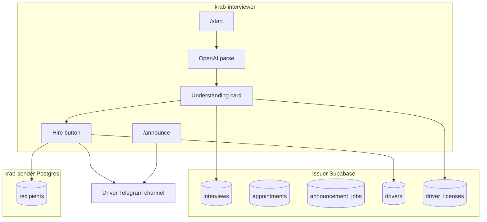

# Krab Interviewer

Third brand Telegram bot: driver interviews, appointment reminders, channel announcements, and hire onboarding into **krableadsV2** (Issuer Supabase `drivers`) and **krab-sender** (Postgres `recipients`).

## Setup

1. Copy `.env.example` to `.env` and fill values (new bot token from [@BotFather](https://t.me/BotFather)).
2. Run SQL migrations in shared Issuer Supabase:
   - [`database/migration_krab_interviewer.sql`](database/migration_krab_interviewer.sql)
   - [`database/migration_interview_drafts.sql`](database/migration_interview_drafts.sql) (web form)
   - [`database/migration_telegram_user_directory.sql`](database/migration_telegram_user_directory.sql) (username → Telegram ID for web apply)
3. Create Storage bucket **`driver_licenses`** (public read) in Supabase Dashboard.
4. Add the bot as **admin** to `DRIVER_CHANNEL_ID` (channel for driver announcements).
5. Install and run:

```bash
cd krab-interviewer
pip install -r requirements.txt
python bot.py
```

## Environment variables

| Variable | Required | Description |
|----------|----------|-------------|
| `TELEGRAM_BOT_TOKEN` | yes | This bot's token |
| `SUPABASE_URL` | yes | Shared Issuer Supabase (same as krableadsV2) |
| `SUPABASE_KEY` | yes | Service role key |
| `SUPERVISORY_TELEGRAM_ID` | yes | Comma-separated supervisor user IDs |
| `OPENAI_API_KEY` | yes | Interview parsing (vision + text) |
| `DRIVER_CHANNEL_ID` | yes | Channel ID for announcements (e.g. `-1001234567890`) |
| `KRAB_SENDER_DATABASE_URL` | for Hire | krab-sender Postgres DSN (`recipients` insert) |
| `INTERVIEWER_TIMEZONE` | no | Default `America/New_York` |
| `KRAB_DISPATCH_BOT_USERNAME` | no | Shown to new hires (default `Krabdispatchbot`) |
| `ADMIN_PASSWORD` | web admin | Password for `/admin` dashboard |
| `IP_HASH_SALT` | web form | Salt for hashing visitor IPs (never store raw IP) |
| `KRAB_PUBLIC_BASE_URL` | no | Public URL for secure cookies (e.g. `https://krab-interviewer-bot.onrender.com`) |
| `KRAB_API_CORS_ALLOWED_ORIGINS` | no | Default `*`; comma-list to restrict embed origins |

## Web form + dashboard

FastAPI runs in the **same process** as `python bot.py` (background thread on `PORT`).

| URL | Purpose |
|-----|---------|
| `/` | Hiring funnel landing (hero, steps, photos) |
| `/requirements` | Driver requirements checklist |
| `/interview` | Application form (auto-save drafts) |
| `/interview/embed` | How to embed on another site/project |
| `/how-to-telegram` | Telegram install + @username guide |
| `/admin` | Supervisor table (red / yellow / green badges) |
| `/api/health` | Render health check |

**Copy to another site (no iframes):** entire folder [`driver-hiring-kit/`](driver-hiring-kit/) + [`driver-hiring-kit/AI-WIRE-UP.md`](driver-hiring-kit/AI-WIRE-UP.md).

Embedding and API docs: [`web/README.md`](web/README.md).

## Supervisor commands

| Command | Description |
|---------|-------------|
| `/start` | Interview entry: **Now** or **Appointment** |
| `/interviews` | List interviews (tap to open) |
| `/drivers` | List Issuer drivers (tap for profile + latest interview) |
| `/open <id>` | Full interview Q&A + license URL |
| `/announce` | Post next message to drivers channel immediately |
| `/announce_schedule` | Schedule a channel post (time, then content) |
| `/cancel` | Cancel current flow |

## Candidate flow

Any user can `/start` and submit the questionnaire (photo or text). Supervisors use **Hire** on the review card.

## Smoke test checklist

1. **Migration** — Run `migration_krab_interviewer.sql`; confirm `interviews`, `appointments`, `announcement_jobs` exist.
2. **Storage** — Bucket `driver_licenses` exists; upload test from bot (Upload license button).
3. **Supervisor /start** — See Now / Appointment buttons.
4. **Now** — Paste sample text with all 11 fields; confirm "Here's how I understood" card with 4 buttons.
5. **Edit** — Change phone; card updates; transient prompts deleted.
6. **Schedule appointment** — Set time 2 minutes ahead; wait for reminder DM.
7. **Hire** (supervisor only) — Verify row in Supabase `drivers` and krab-sender `recipients` (same first name + telegram id + email).
8. **Channel** — `/announce` posts to `DRIVER_CHANNEL_ID`.
9. **Scheduled announce** — `/announce_schedule` → time → content; fires at scheduled time.

## Deploy (Render)

**This repo (standalone):** push to [github.com/Kuwguap/krab-interviewer](https://github.com/Kuwguap/krab-interviewer), then Render → **New +** → **Blueprint** → select **krab-interviewer**. Render uses [`render.yaml`](render.yaml) at the repo root.

**Monorepo (unity):** the parent repo’s root [`render.yaml`](../render.yaml) also defines **`krab-interviewer-bot`** with `rootDir: krab-interviewer`.

**Monorepo blueprint:** unity root `render.yaml` wires `SUPABASE_*`, `SUPERVISORY_TELEGRAM_ID`, `OPENAI_API_KEY`, and `KRAB_SENDER_DATABASE_URL` from **krab-issuer-bot** / **krab-dispatch-api** via `fromService`. You only need to add secrets that are not linked:

| Variable | Notes |
|----------|--------|
| `TELEGRAM_BOT_TOKEN` | New bot from @BotFather (not the Issuer/Dispatch token) |
| `DRIVER_CHANNEL_ID` | Channel ID (e.g. `-100…`); bot must be **admin** in that channel |

**Standalone repo:** set all vars manually in Environment (Render only prompts for `sync: false` on *first* blueprint create; updates ignore them).

If Environment shows only timezone/model defaults, add the two rows above manually, or re-sync the monorepo blueprint after `krab-issuer-bot` and `krab-dispatch-api` already have their env filled in.

One **web** service, `python bot.py`, `healthCheckPath: /api/health`, `numInstances: 1` (only one instance may poll a given bot token).

## Architecture


